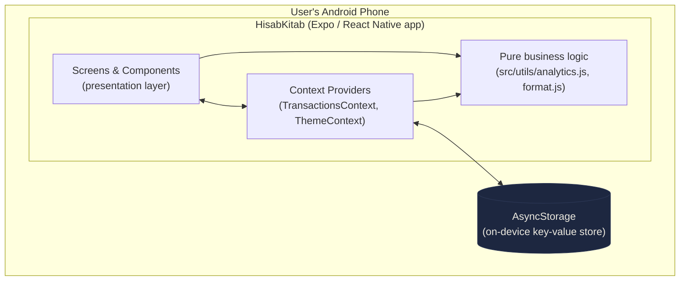
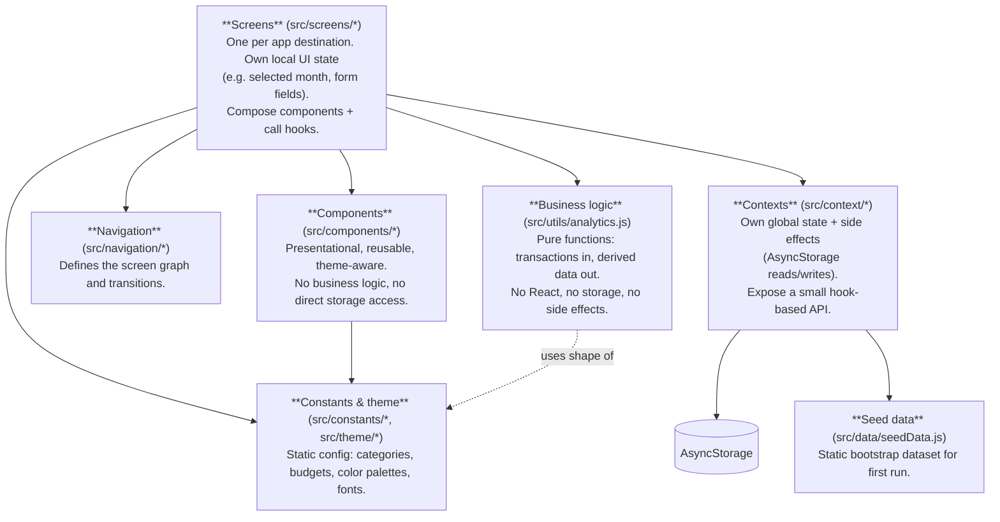
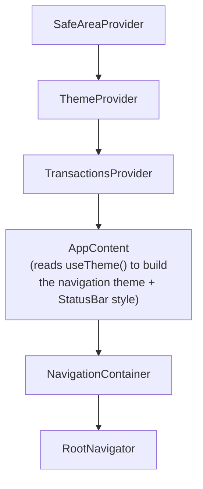
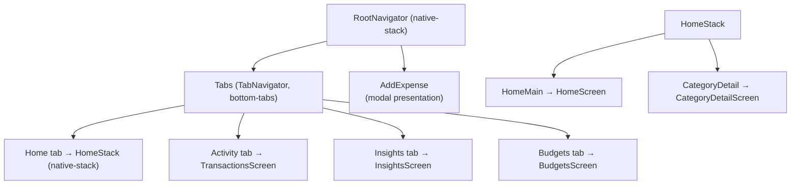
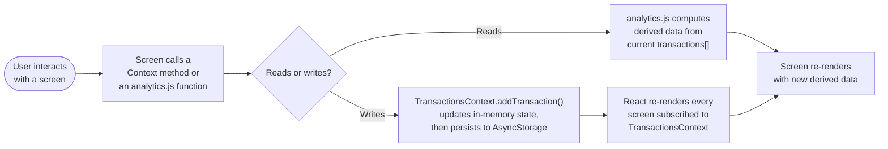

# 3. System Architecture

## 3.1 High-level architecture

There is no client-server split. The entire system is a single mobile app process running on the user's phone; "storage" is a local on-device key-value store, not a remote database.

There is intentionally **no network boundary** in this diagram — the app never makes an HTTP request. Everything above the `AsyncStorage` line runs synchronously in JS on the device; the only asynchronous boundary is reading/writing AsyncStorage itself.

## 3.2 Layered architecture (the app's internal structure)

Even without a backend, the codebase is organized in layers, each with a single responsibility. This is the mental model to hold when deciding "where does this code belong?"

**The most important rule this enforces:** `src/utils/analytics.js` never imports React, never touches `AsyncStorage`, and never imports a Context. It only takes plain JS arrays/objects as input and returns plain JS arrays/objects as output. This is why it's called out as its own layer — see [06-state-management-and-internal-api.md](06-state-management-and-internal-api.md) and [08-business-logic-and-analytics.md](08-business-logic-and-analytics.md) for why that matters (testability, no side effects to mock, screens can call the same functions with different inputs freely).

## 3.3 Provider tree (React composition at runtime)

`App.js` is the composition root. Every screen in the app is rendered underneath this exact provider nesting:

Why this order matters:
- `SafeAreaProvider` must be outermost — everything below it needs `useSafeAreaInsets()`.
- `ThemeProvider` wraps `TransactionsProvider` (and everything else) because the theme (dark/light) is needed by literally every screen and component, including ones that don't touch transactions (e.g. a hypothetical settings screen).
- `AppContent` is a separate inner component (not inlined in `App`) purely so it can call `useTheme()` — a component can't consume a context that it also renders the provider for.

See `App.js` for the exact code.

## 3.4 Screen/navigation architecture

Full detail (including why `AddExpense` is a sibling of `Tabs` rather than nested inside it) is in [07-frontend-architecture.md](07-frontend-architecture.md).

## 3.5 Data flow, one level up

At the highest level, every user action follows the same loop:

A full worked sequence diagram for "add an expense" and "insights on Home load" is in [09-data-flow-and-diagrams.md](09-data-flow-and-diagrams.md).

## 3.6 Why no backend at all (architectural consequence)

Because there's no server, several things that would normally be "backend concerns" are handled differently here — worth stating explicitly so nothing is assumed to exist:

- **No request validation layer** — form validation happens directly in `AddExpenseScreen` (see [07-frontend-architecture.md](07-frontend-architecture.md)).
- **No auth middleware** — there's nothing to authenticate against; see [14-security.md](14-security.md).
- **No API versioning concerns** — the "API" (Context + analytics functions) and its only consumer (the UI) ship together in the same bundle; they can never be out of sync.
- **No database migrations** — the stored shape is just "whatever `JSON.parse` returns from the one AsyncStorage key." If the `Transaction` shape changes in the future, a migration would need to be written by hand in `TransactionsContext`'s load path (see [05-data-model.md](05-data-model.md) for a note on this).

## 3.7 Where to go next

- Directory-by-directory breakdown: [04-folder-structure.md](04-folder-structure.md)
- The `Transaction` data shape in detail: [05-data-model.md](05-data-model.md)
- Full Context and analytics function reference: [06-state-management-and-internal-api.md](06-state-management-and-internal-api.md)
