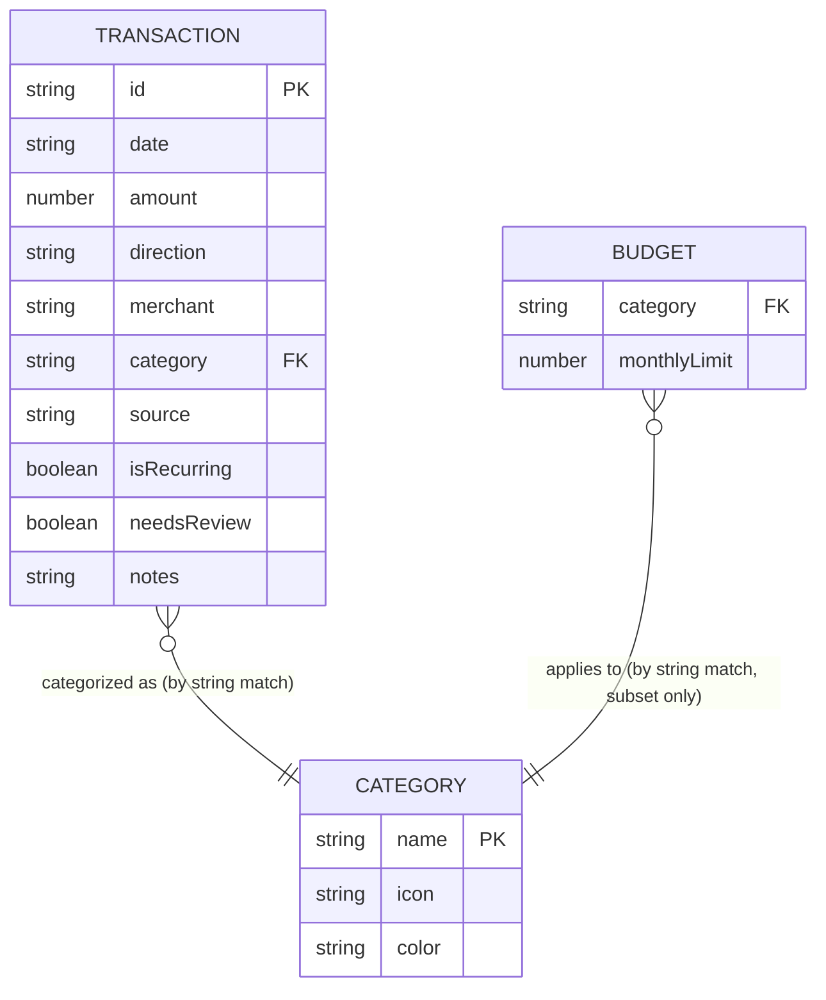

# 5. Data Model

*(This is the "database design" doc for a project that has no database — see the note in [README.md](README.md). Everything below lives in `AsyncStorage` on the device, not in a relational or document database.)*

## 5.1 Where data physically lives

| Storage key | Holds | Written by |
|---|---|---|
| `@hisabkitab/transactions` | The entire transaction list, as one JSON-stringified array | `TransactionsContext` |
| `@hisabkitab/theme-mode` | The string `"dark"` or `"light"` | `ThemeContext` |

Both are plain `AsyncStorage.setItem(key, JSON.stringify(value))` / `AsyncStorage.getItem(key)` calls — there is no schema enforcement, no indexes, no queries. All filtering/aggregation happens in JS after loading the full array into memory (see [08-business-logic-and-analytics.md](08-business-logic-and-analytics.md)).

## 5.2 The `Transaction` entity

This is the one and only "table" in the system. Defined (as a shape, not a formal schema/type) across `src/data/seedData.js`, `src/context/TransactionsContext.js`, and consumed everywhere in `src/utils/analytics.js`.

| Field | Type | Example | Notes |
|---|---|---|---|
| `id` | `string` | `"txn047"` / `"txn-25-483920"` | Seed data uses `txn001`…`txn154` (zero-padded). User-added transactions get `txn-{count}-{random 0-999999}` from `TransactionsContext.addTransaction`. **Not a UUID** — see [16-design-decisions-and-tradeoffs.md](16-design-decisions-and-tradeoffs.md) for why this is fine at this scale. |
| `date` | `string` (ISO `YYYY-MM-DD`) | `"2026-07-03"` | No time component. All month/date logic (`monthKey`, sorting, etc.) works on this string directly. |
| `amount` | `number` | `2200` | Indian Rupees, no decimal paise in the seed data (all whole rupees). Always positive — sign/direction is carried separately by `direction`, not by a negative amount. |
| `direction` | `'debit' \| 'credit'` | `"debit"` | `'debit'` = money out (an expense). `'credit'` = money in. **All seed data and all analytics functions currently assume debit-only** — see §5.5. |
| `merchant` | `string` | `"Swiggy"` | Free text, user-entered or from seed data. Used as the grouping key for `getMerchantBreakdown`. |
| `category` | `string` | `"Food & Dining"` | Must be one of the 8 keys in `CATEGORY_LIST` (see §5.3) for icons/colors to resolve; unrecognized categories fall back to the "Other" icon/color in the UI (`CATEGORIES[category] || CATEGORIES.Other`), but the raw string is still stored and displayed as-is. |
| `source` | `'GPay' \| 'PhonePe' \| 'Paytm' \| 'PayZapp' \| 'Bank' \| 'Manual'` | `"GPay"` | Where the transaction came from. Every transaction added via the app's form is `'Manual'`; the other five values only appear in seed data (representing a *future* ingestion phase — see [17-future-improvements.md](17-future-improvements.md)). |
| `isRecurring` | `boolean` | `true` | Marks subscriptions/bills. Drives the "subscription growth" insight and the "upcoming renewals" list. |
| `needsReview` | `boolean` | `false` | Flags a transaction for manual review. In v1 (manual entry only), this is only ever set by the seed data (on cash/ATM withdrawals, as a realistic example) — it becomes meaningful once Phase 2/3 auto-categorization ingestion ships (ADR-004), where low-confidence matches would set this to `true`. |
| `notes` | `string` (optional) | `"New subscription this month"` | Free text. Omitted entirely from the object when empty (not stored as `""` or `null`) — see the seed-data helper in §5.4. |

### JSDoc-style reference shape

```js
/**
 * @typedef {Object} Transaction
 * @property {string} id
 * @property {string} date          - ISO 8601 date, 'YYYY-MM-DD'
 * @property {number} amount        - positive number, INR
 * @property {'debit'|'credit'} direction
 * @property {string} merchant
 * @property {string} category      - one of CATEGORY_LIST
 * @property {'GPay'|'PhonePe'|'Paytm'|'PayZapp'|'Bank'|'Manual'} source
 * @property {boolean} isRecurring
 * @property {boolean} needsReview
 * @property {string} [notes]
 */
```

This matches the `Transaction` type declared in the original ADR (section 3) exactly.

## 5.3 Configuration "entities" (static, not user-editable at runtime)

These aren't stored in AsyncStorage at all — they're hard-coded config in `src/constants/categories.js`, imported wherever needed. Think of them as reference/lookup tables that happen to live in source code instead of a database.

**`CATEGORIES`** — one entry per category, giving its icon and accent color:

```js
{
  'Food & Dining':      { color: shared.coral,   icon: '🍔' },
  Shopping:             { color: shared.amber,   icon: '🛍️' },
  'Bills & Utilities':  { color: shared.violet,  icon: '💡' },
  Transport:            { color: shared.teal,    icon: '🚗' },
  Subscriptions:        { color: shared.neutral, icon: '🎬' },
  Groceries:            { color: shared.teal,    icon: '🛒' },
  Travel:               { color: shared.amber,   icon: '✈️' },
  Other:                { color: shared.neutral, icon: '❓' },
}
```

`CATEGORY_LIST` is just `Object.keys(CATEGORIES)` — the canonical list of valid category strings, used to populate the category picker in `AddExpenseScreen`.

**`BUDGETS`** — a monthly budget ceiling for a subset of categories (only 4 of the 8 have a budget defined; the rest are tracked but not budgeted):

```js
{
  'Food & Dining': 10000,
  Shopping: 15000,
  Transport: 6000,
  Subscriptions: 5000,
}
```

**`MONTHLY_BUDGET`** — a single number (`60000`), the overall monthly spend ceiling shown on `HomeScreen`'s pace bar.

**`SOURCES`** — `['GPay', 'PhonePe', 'Paytm', 'PayZapp', 'Bank', 'Manual']`, the fixed list shown on `BudgetsScreen`'s "Connected sources" panel.

## 5.4 The seed dataset

`src/data/seedData.js` exports a hard-coded array of ~154 `Transaction` objects spanning February–July 2026, built with a small local helper:

```js
let n = 0;
const id = () => `txn${String((n += 1)).padStart(3, '0')}`;

const t = (date, amount, merchant, category, source, opts = {}) => ({
  id: id(),
  date, amount, direction: 'debit', merchant, category, source,
  isRecurring: opts.isRecurring || false,
  needsReview: opts.needsReview || false,
  ...(opts.notes ? { notes: opts.notes } : {}),
});
```

This data isn't random — it's deliberately tuned so that, as soon as the app opens, the insight rules in `generateInsights` actually fire (see [08-business-logic-and-analytics.md](08-business-logic-and-analytics.md) for the exact numbers): Food & Dining spikes to 41% of monthly spend in the most recent month (July), triggering both the "category share" and "trend" alerts; a new subscription (YouTube Premium) triggers the "subscription growth" alert; and four other categories land within ±5% of their 6-month average, triggering "on track" insights. This makes the app demonstrably useful on first launch instead of showing an empty dashboard.

`TransactionsContext` loads this array into `AsyncStorage` **only if the storage key doesn't exist yet** (first run). After that, the seed data is just the starting point — the user's own added/edited data takes over.

## 5.5 "Relationships" (conceptual — not foreign keys)

There's no relational database, so there are no foreign keys or joins. But conceptually, the data does relate in a fixed way:



Notes on this diagram:
- The `category` "foreign key" is a **string match, not an enforced constraint**. Nothing prevents a `Transaction.category` value that doesn't exist in `CATEGORIES` — the UI just falls back to a default icon/color if so (see §5.2). There's no referential integrity check anywhere in the code.
- `BUDGET`'s relationship to `CATEGORY` is **partial** — only 4 of 8 categories have a budget row. Categories without a budget are tracked (they appear in `getCategoryTotals`) but never flagged as over/under budget.
- There is no `MERCHANT` or `SOURCE` table — those are just free-text/enum string fields on `Transaction`, not normalized out.

## 5.6 Data volume and scaling assumptions

The whole dataset (a few hundred to a few thousand transactions for one person over a few years) is loaded into memory as a single JS array on every app start, and every analytics function does a full `Array.filter`/`.reduce` pass over it. This is fine at the expected scale (a personal expense tracker, one user, realistically well under 10,000 transactions even after years of use) and deliberately avoids the complexity of pagination, indexing, or a real embedded database. See [15-performance.md](15-performance.md) for the actual performance reasoning, and [16-design-decisions-and-tradeoffs.md](16-design-decisions-and-tradeoffs.md) for when this assumption would need to be revisited.

## 5.7 Schema evolution / migrations

There is currently **no migration mechanism**. If you need to change the `Transaction` shape (e.g. add a required field), you must handle both:

1. **New data** — update wherever transactions are created (`AddExpenseScreen` → `addTransaction`, and `seedData.js` if relevant).
2. **Existing stored data** — anyone with the app already installed has old-shape objects sitting in `AsyncStorage`. You need to either (a) make the new field optional and handle `undefined` everywhere it's read, or (b) write a one-time migration in `TransactionsContext`'s load effect that maps over the loaded array and backfills the new field before calling `setTransactions`.

See [18-developer-guide.md](18-developer-guide.md#adding-a-field-to-the-transaction-shape) for the concrete steps.
