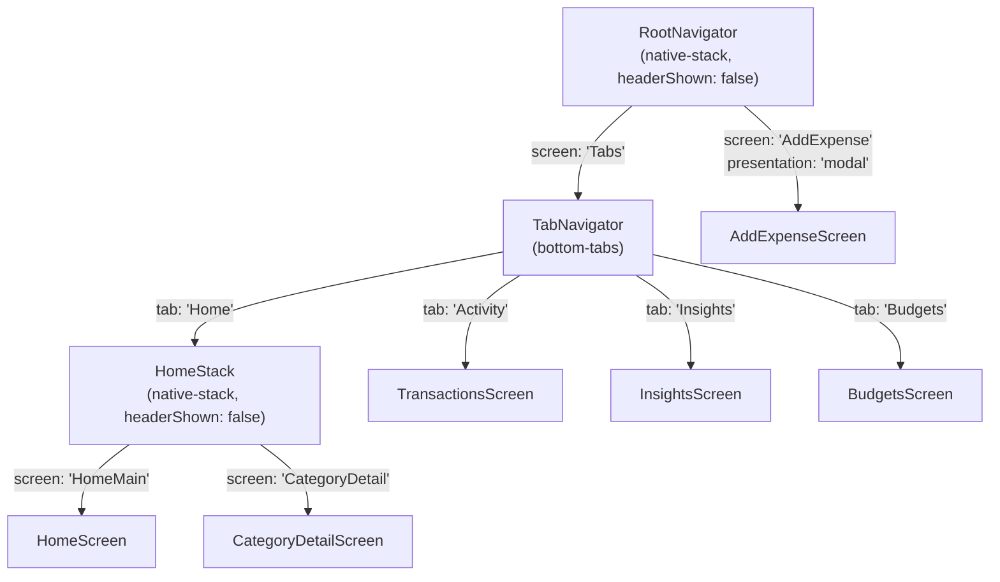

# 7. Frontend Architecture

## 7.1 Routing / Navigation

Built entirely with `@react-navigation`. Three navigators compose the full screen graph:



**Why `AddExpense` is a sibling of `Tabs`, not nested inside it** (`RootNavigator.js`): it needs to render as a full-screen **modal over the tab bar**, reachable from any tab (the FAB is on `HomeScreen`, but a quick-add chip also opens it). If it were nested inside `TabNavigator`, it would only be reachable from within a specific tab and would render underneath the tab bar rather than over it.

**Why `HomeStack` is nested inside the `Home` tab** (`TabNavigator.js`): only the Home tab has a drill-down (`CategoryDetail`). The other three tabs (`Activity`, `Insights`, `Budgets`) are single flat screens with no further push navigation, so they're registered directly as the tab's `component`, with no wrapping stack.

### Navigating between them

| From | To | How |
|---|---|---|
| `HomeScreen` FAB (+) | `AddExpenseScreen` (no prefilled category) | `navigation.navigate('AddExpense')` |
| `HomeScreen` quick-add chip | `AddExpenseScreen` (prefilled category) | `navigation.navigate('AddExpense', { category })` |
| `HomeScreen` category row | `CategoryDetailScreen` | `navigation.navigate('CategoryDetail', { category })` |
| `HomeScreen` "History →" link | `Activity` tab | `navigation.getParent()?.navigate('Activity')` — `getParent()` is required because `HomeScreen` lives inside `HomeStack`, one level below the tab navigator; a plain `navigation.navigate('Activity')` from inside `HomeScreen` would fail to find a tab named `'Activity'` in its own (stack) navigator. |
| `CategoryDetailScreen` back button | `HomeScreen` | `navigation.goBack()` |
| `AddExpenseScreen` close (✕) or after save | wherever it was opened from | `navigation.goBack()` |

### Route params

Only two screens receive params, both read via the `route` prop:

- `CategoryDetailScreen({ route })` → `route.params.category` (required — always passed by the caller)
- `AddExpenseScreen({ route })` → `route.params?.category` (optional — falls back to `CATEGORY_LIST[0]` if not passed, i.e. when opened from the FAB rather than a quick-add chip)

## 7.2 Screens

Each screen is a default-exported function component in `src/screens/`, registered in a navigator. All screens follow the same shape: read global state via Context hooks, derive per-screen data with `analytics.js`, hold any screen-local UI state (e.g. "which month is selected") with `useState`, and render.

### `HomeScreen.js`
**Route:** `Tabs → Home → HomeMain`
**Purpose:** The main dashboard — the first thing the user sees.
**Local state:** `selectedMonth` (`string | null`) — `null` means "use the most recent month" (`months[0].month`); set explicitly once the user picks a different month from `MonthDropdown`.
**Data derived (all via `useMemo`, recomputed when `transactions` or `activeMonth` change):** `months`, `monthTxns`, `total`, `delta`, `categoryTotals`, `topTransactions`, `recentTransactions`, `insights`, `renewals`, `maxCategoryTotal`.
**Layout:** a fixed (non-scrolling) header — app name on its own line, then a row with the month dropdown (left) and theme toggle (right) — above a `ScrollView` containing: total/budget card → top insight banner (only the single highest-priority insight, `insights[0]`) → quick-add chips → top transactions → recent activity (+ link to Activity tab) → upcoming renewals (if any) → full category breakdown. A floating action button (FAB) is pinned bottom-right, above the scroll content, via `position: 'absolute'`.
**Why only `insights[0]` here:** `generateInsights` can return several insights; showing all of them on the dashboard would push the rest of the content down. The full list is one tab away (`InsightsScreen`) — this card is a teaser, not the primary insights UI.

### `CategoryDetailScreen.js`
**Route:** `Tabs → Home → CategoryDetail` (pushed)
**Purpose:** Drill-down for one category: a 6-month trend bar chart and a merchant-level breakdown.
**Props used:** `route.params.category`.
**Data derived:** `trend` (`getCategoryTrend(transactions, category, 6)`), `merchants` (`getMerchantBreakdown`), and `total` (the trend's last/most-recent month value).
**Notable implementation detail:** the bar chart (`TrendChart`, a private sub-component defined in the same file) is hand-rolled with plain `View`s — each bar's `height` is a `%` string proportional to `total / max`. No charting library is used (see [02-tech-stack.md](02-tech-stack.md)).
**Navigation:** custom in-content "‹ Back" text button calling `navigation.goBack()` — there's no native header (all navigators in this app set `headerShown: false`), so every screen that needs a back affordance builds its own.

### `TransactionsScreen.js`
**Route:** `Tabs → Activity`
**Purpose:** The full, unfiltered transaction history, most recent first.
**Data derived:** `sorted` — all transactions sorted by `date` descending (no month filter, no category filter — this is deliberately the "everything" view, unlike `HomeScreen` which is scoped to one month).
**Rendering:** `FlatList` (not `ScrollView` + `.map`) — see [15-performance.md](15-performance.md) for why this matters once the list grows.

### `InsightsScreen.js`
**Route:** `Tabs → Insights`
**Purpose:** The full list of insights for the most recent month (unlike `HomeScreen`'s single-insight teaser).
**Data derived:** `activeMonth` (always the latest month — there's no month picker on this screen, unlike Home), `insights` (`generateInsights(transactions, activeMonth)`).
**Empty state:** shows "No insights for this month yet." via `FlatList`'s `ListEmptyComponent` if the rules don't fire for any category that month.

### `BudgetsScreen.js`
**Route:** `Tabs → Budgets`
**Purpose:** Two independent panels — budget-vs-actual per category, and a static "connected sources" status list.
**Data derived:** `activeMonth` (latest), `categoryTotals` for that month, converted to a `Map` (`totalsByCategory`) for O(1) lookup per budgeted category.
**Business logic inline in this screen (not in `analytics.js`):** for each of the 4 budgeted categories, `fraction = actual / budget` and `overBudget = actual > budget` are computed directly in the render loop, then handed to `CategoryBar` as props. This was kept inline rather than added to `analytics.js` because it's a trivial one-line derivation specific to how this screen renders a bar, not a reusable "insight" — see [16-design-decisions-and-tradeoffs.md](16-design-decisions-and-tradeoffs.md) for the general rule of thumb on this boundary.
**Connected sources:** a hard-coded `CONNECTED_SOURCES = new Set(['Manual'])` — every source except `'Manual'` shows "Not connected" (accurately reflecting that no real UPI/bank integration exists yet — see [01-project-overview.md](01-project-overview.md)).

### `AddExpenseScreen.js`
**Route:** `AddExpense` (modal, pushed from `RootNavigator`)
**Purpose:** The only way to create a transaction in v1.
**Local state:** `amount`, `merchant`, `category` (defaults to `route.params?.category` or `CATEGORY_LIST[0]`), `date` (defaults to today, `YYYY-MM-DD`), `error`.
**Validation (`handleSubmit`):**
```js
const parsed = Number(amount);
if (!merchant.trim() || Number.isNaN(parsed) || parsed <= 0) {
  setError('Enter a valid amount and merchant.');
  return;
}
```
Also gates the submit button itself via `canSubmit` (disabled unless amount is non-empty, parses as a number, and merchant is non-empty) — so the inline error only fires in the edge case where `canSubmit` was momentarily true but the value changed (defense in depth, not the primary UX gate).
**On success:** calls `addTransaction({ amount: parsed, merchant: merchant.trim(), category, date, source: 'Manual' })` then `navigation.goBack()`. No confirmation toast — the modal closing and the new transaction appearing on Home/Activity is the confirmation.
**"Coming soon" tabs:** a 3-way segmented control (Manual / Statement / SMS export) where only "Manual" is interactive — the other two are `View`s (not `TouchableOpacity`) styled at `opacity: 0.5`, per ADR-006's instruction to show the future ingestion paths in the IA now without building them yet.

## 7.3 Components

All components in `src/components/` are **presentational** — they take props, read `useTheme()` for styling, and render. None of them read `TransactionsContext`, call `analytics.js`, or navigate. This is a hard boundary: business logic and data-fetching stay in screens; components only know how to display what they're given.

| Component | Props | Purpose |
|---|---|---|
| `Card` | `children`, `style?` | Generic bordered, rounded, padded surface. The base visual container reused by nearly every section on every screen. |
| `MonthDropdown` | `months`, `selectedMonth`, `onSelect` | Tap-to-open month picker. Internally owns its own `open` boolean state (whether the modal sheet is visible) — this is the one piece of local UI state a component is allowed to own, since it's purely presentational (doesn't affect any other component). |
| `TotalCard` | `total`, `delta?` | Big monospace total + the month-over-month delta arrow + the budget pace bar (reads `MONTHLY_BUDGET` from constants directly, not a prop — this is app-wide static config, not something a parent would ever want to override). |
| `InsightBanner` | `insight` | Renders one insight object with a severity-colored left border and icon (⚠️ alert/warning, ✓ positive). |
| `QuickAddChips` | `onSelect` | Row of 4 hard-coded category shortcuts (`QUICK_CATEGORIES` — Food & Dining, Transport, Groceries, Shopping — chosen as the most frequently logged categories, not derived dynamically). |
| `CategoryBar` | `category`, `amount`, `fraction`, `rightLabel?`, `overBudget?`, `onPress?` | The single most reused component — a labeled proportional bar. Used for both "category breakdown" (Home) and "budget vs actual" (Budgets), which is why it accepts a generic `fraction` (0–1) rather than computing one itself: the caller decides what the bar is a fraction *of* (share of the largest category vs. share of a budget ceiling). Renders as a `TouchableOpacity` if `onPress` is passed, otherwise a plain `View`. |
| `TransactionRow` | `transaction` | One line: category icon, merchant, date + source (+ "Needs review" if flagged), amount (colored teal if `direction === 'credit'`). |

## 7.4 State management (recap, frontend-focused)

Three tiers of state exist in this app, and knowing which tier a piece of state belongs in is the main architectural judgment call a contributor will make:

1. **Global, persisted, cross-screen** → a Context (`TransactionsContext`, `ThemeContext`). Criteria: needed by more than one screen, and/or must survive app restarts.
2. **Screen-local, ephemeral** → `useState` inside the screen component. Criteria: only one screen cares about it, and it's fine for it to reset when you navigate away (e.g. `HomeScreen`'s `selectedMonth`, `AddExpenseScreen`'s form fields).
3. **Derived, not stored anywhere** → computed inline with `useMemo`, from #1 and #2. Criteria: it's a pure function of other state — storing it separately would just create a cache-invalidation bug. This is *all* of `analytics.js`'s output — nothing it returns is ever put into `useState`.

There is no prop-drilling problem in this app precisely because the tree is shallow (screens are direct children of navigators, components are direct children of screens) — Context is only reached for truly global concerns, not as a workaround for deep prop passing.

## 7.5 Styling architecture

Every component/screen follows the same pattern, introduced when the dark/light theme toggle was added (see [16-design-decisions-and-tradeoffs.md](16-design-decisions-and-tradeoffs.md) for why):

```js
export default function SomeComponent(props) {
  const { colors } = useTheme();
  const styles = makeStyles(colors);
  return (/* JSX using styles.xxx */);
}

const makeStyles = (colors) => StyleSheet.create({
  container: { backgroundColor: colors.void, /* ... */ },
});
```

`makeStyles` is called on every render (not memoized with `useMemo`) — deliberately, for simplicity, since `StyleSheet.create` on a small object is cheap and this app's component tree is small. See [15-performance.md](15-performance.md) for the reasoning and when this would need to change.

Font families (`fonts.display` / `fonts.mono` from `src/theme/typography.js`) are theme-independent — the serif/monospace choice doesn't change between dark and light mode, only colors do.
