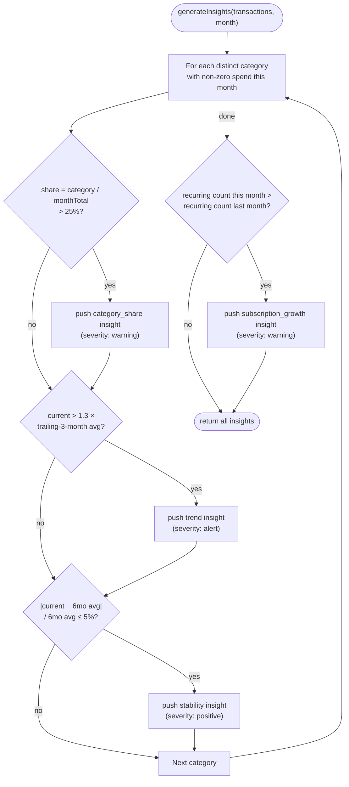

# 8. Business Logic & Analytics — in detail

This is the "why does the app say that?" document. Every rule below is implemented in `src/utils/analytics.js` (function signatures documented in [06-state-management-and-internal-api.md](06-state-management-and-internal-api.md)). All worked examples use the real bundled seed dataset (`src/data/seedData.js`), so you can reproduce every number here by running the app fresh.

## 8.1 Expense calculation logic

### Monthly total
"Total spent this month" (shown on `HomeScreen`'s `TotalCard`) is:

```js
const monthTxns = filterByMonth(transactions, activeMonth);
const total = monthTxns.filter(t => t.direction === 'debit').reduce((s, t) => s + t.amount, 0);
```

i.e. **sum of `amount` for every transaction dated in the selected month, where `direction === 'debit'`.** Credits are excluded from spend totals everywhere in the app — see §8.6 for why this matters and its current limitation.

### Category totals
`getCategoryTotals(transactions)` groups debit transactions by `category` and sums, sorted descending. Example — July 2026 (the most recent seed month):

| Category | Total |
|---|---|
| Food & Dining | ₹18,000 |
| Shopping | ₹9,000 |
| Groceries | ₹7,200 |
| Bills & Utilities | ₹4,500 |
| Transport | ₹3,200 |
| Subscriptions | ₹1,331 |
| Other | ₹1,200 |

(Total: ₹44,431 — matches the `TotalCard` total for July.)

### Month-over-month delta
`getMonthOverMonthDelta(transactions, key)`:

```js
const prevKey = shiftMonthKey(key, -1);
const current = /* sum of debits in `key` */;
const previous = /* sum of debits in `prevKey` */;

if (previous === 0) {
  return { percent: current === 0 ? 0 : 100, direction: current >= 0 ? 'up' : 'down' };
}
const percent = ((current - previous) / previous) * 100;
return {
  percent: Math.round(Math.abs(percent) * 10) / 10,
  direction: percent > 0 ? 'up' : percent < 0 ? 'down' : 'flat',
};
```

**Worked example:** June 2026 total = ₹39,492; July 2026 total = ₹44,431.
`percent = (44431 − 39492) / 39492 × 100 = 12.5%`, `direction = 'up'`.
This is exactly what `TotalCard` renders: "▲ 12.5% vs last month".

**Edge case handled:** if the previous month has zero recorded spend, dividing would produce `Infinity`/`NaN` — the function special-cases `previous === 0` to return a flat `100%` "up" (or `0%` if both are zero) instead. This means a category/month appearing for the very first time is reported as "100% up" rather than crashing or showing `NaN%`.

**Known limitation:** `shiftMonthKey` moves by exactly one calendar month regardless of whether any data exists there — if the user skipped logging expenses for a month entirely, "previous month" will correctly be treated as zero (triggering the edge case above), not silently compared against the last month that *has* data.

## 8.2 Budget calculation logic

Two independent budget concepts exist, computed differently, on two different screens:

### Overall budget pace (Home → `TotalCard`)
```js
const pace = Math.min(total / MONTHLY_BUDGET, 1);      // clamped 0–1, for the bar width
const overBudget = total > MONTHLY_BUDGET;             // unclamped, for the color
```
`MONTHLY_BUDGET` is the static `60000` from `src/constants/categories.js`. The bar fills proportionally to `pace`, colored amber normally and coral (red) once `total > MONTHLY_BUDGET`. Note the bar's *width* is clamped at 100% (`Math.min(..., 1)`) even if spend is 150% of budget — only the color communicates "over," not an overflowing bar.

### Per-category budget vs. actual (`BudgetsScreen`)
```js
Object.entries(BUDGETS).map(([category, budget]) => {
  const actual = totalsByCategory.get(category) || 0;
  return { fraction: actual / budget, overBudget: actual > budget, rightLabel: `${actual} / ${budget}` };
});
```
Only the 4 categories with an entry in `BUDGETS` (`Food & Dining`, `Shopping`, `Transport`, `Subscriptions`) get a bar here — the other 4 categories are tracked (visible in the Home breakdown) but have no budget ceiling to compare against, by design (see [05-data-model.md](05-data-model.md#53-configuration-entities-static-not-user-editable-at-runtime)).

**Worked example (July 2026):** `Food & Dining` budget = ₹10,000, actual = ₹18,000 → `fraction = 1.8` (bar renders clamped at 100% width via `CategoryBar`'s own `Math.min(fraction, 1)`), `overBudget = true` → bar renders coral, label reads "₹18,000 / ₹10,000".

## 8.3 Insight rules — in detail

`generateInsights(transactions, key)` evaluates **four independent rules**, once per category present in the data, plus one whole-month rule. Below is each rule's exact logic and a real fired example from the seed data (month = July 2026).



### Rule 1 — Category share alert
**Logic:** if a category's spend is more than 25% of the month's total debit spend, flag it.
```js
const share = monthTotal > 0 ? (currentTotal / monthTotal) * 100 : 0;
if (share > 25) { /* push insight, severity: 'warning' */ }
```
**Fired example (July 2026):** Food & Dining = ₹18,000 of ₹44,431 total = **40.5%** → *"Food & Dining is 41% of this month's spend."* (message rounds to the nearest whole percent; `meta.share` stores the unrounded-to-1-decimal `40.5`).

### Rule 2 — Trend alert
**Logic:** compare this month's category total to the trailing 3-month average *excluding* the current month. If current exceeds **1.3×** that average, flag it.
```js
const trailingMonths = [shiftMonthKey(key, -1), shiftMonthKey(key, -2), shiftMonthKey(key, -3)];
const trailingAvg = /* average of category totals in those 3 months */;
if (trailingAvg > 0 && currentTotal > trailingAvg * 1.3) { /* push insight, severity: 'alert' */ }
```
**Fired example:** Food & Dining trailing average (Apr ₹11,000 + May ₹12,500 + Jun ₹13,000) / 3 = **₹12,166.67**. July's ₹18,000 is 1.48× that average → *"Food & Dining is up 48% vs your average."*
**Note:** this is the ADR's own headline example (`"food delivery is 28% of spend, up from 15%"`) realized in code — Food & Dining triggers *both* Rule 1 and Rule 2 simultaneously in the seed data, which is intentional (see [05-data-model.md](05-data-model.md#54-the-seed-dataset)).

### Rule 3 — Stability / "on track" note
**Logic:** if a category's current-month total is within **±5%** of its own 6-month average, surface a reassuring note — insights aren't only warnings.
```js
const trend = getCategoryTrend(transactions, category, 6);
const avg6 = /* average of trend[].total */;
if (avg6 > 0 && Math.abs(currentTotal - avg6) / avg6 <= 0.05) { /* push insight, severity: 'positive' */ }
```
**Fired examples (July 2026):** four categories qualify simultaneously:
| Category | 6-mo avg | July actual | Δ |
|---|---|---|---|
| Shopping | ₹8,650 | ₹9,000 | +4.0% |
| Bills & Utilities | ₹4,367 | ₹4,500 | +3.0% |
| Transport | ₹3,050 | ₹3,200 | +4.9% |
| Groceries | ₹7,058 | ₹7,200 | +2.0% |

Each produces e.g. *"Shopping is on track — within 5% of your 6-month average."*

### Rule 4 — Subscription growth
**Logic:** whole-month rule (not per-category). If the count of `isRecurring: true` transactions this month exceeds last month's count, flag it. Note this counts **all** recurring transactions, not just ones categorized `Subscriptions` — `Bills & Utilities` entries (electricity, broadband, etc.) are also marked `isRecurring: true` in the seed data and count toward this total.
```js
const currentRecurringCount = monthTxns.filter(t => t.isRecurring).length;
const prevRecurringCount = /* same, for previous month */;
if (currentRecurringCount > prevRecurringCount) { /* push insight, severity: 'warning' */ }
```
**Fired example:** June 2026 had 8 recurring transactions (4 Bills & Utilities + 4 Subscriptions); July 2026 has 9 (the same 4+4, plus a new YouTube Premium subscription) → *"You added 1 new recurring charge this month."*

### Rule priority / display
`generateInsights` returns all fired insights in the order the rules were evaluated (share → trend → stability, per category, then subscription growth last). `HomeScreen` shows only `insights[0]` as a teaser (see [07-frontend-architecture.md](07-frontend-architecture.md#homescreenjs)); `InsightsScreen` shows the full array. There is no explicit severity-based sort — the *order* insights appear in is an accident of iteration order (categories are visited in the order `Array.from(new Set(transactions.map(t => t.category)))` yields them, which is insertion order of first appearance in the array). If you need a specific priority ordering (e.g. always show `alert` before `warning` before `positive`), that's a gap — see [18-developer-guide.md](18-developer-guide.md).

## 8.4 6-month trend logic (`CategoryDetailScreen`)

`getCategoryTrend(transactions, category, monthsBack = 6)` takes the **last `monthsBack` distinct months present anywhere in the data** (not literally "the last 6 calendar months from today") and returns each month's total for that one category, ascending.

**Worked example — Food & Dining, Feb–Jul 2026:**

| Month | Total |
|---|---|
| 2026-02 | ₹9,000 |
| 2026-03 | ₹9,500 |
| 2026-04 | ₹11,000 |
| 2026-05 | ₹12,500 |
| 2026-06 | ₹13,000 |
| 2026-07 | ₹18,000 |

This exact series is what draws the bar chart on `CategoryDetailScreen` and is also the source data for Rule 2/Rule 3 above (the trailing-3 and trailing-6 averages are just slices/aggregates of this same series).

## 8.5 Merchant breakdown logic

`getMerchantBreakdown(transactions, category)` — simple group-and-sum, descending. **Worked example — Food & Dining, all-time (Feb–Jul 2026):**

| Merchant | Total |
|---|---|
| Swiggy | ₹21,000 |
| Zomato | ₹16,800 |
| Domino's | ₹13,000 |
| Truffles Cafe | ₹11,700 |
| Starbucks | ₹10,500 |

This confirms Swiggy (food delivery) is the single largest driver of the Food & Dining trend spike flagged in §8.3 Rule 2 — exactly the kind of drill-down insight the ADR's problem statement calls for.

## 8.6 Upcoming renewals logic

`getUpcomingRenewals(transactions, referenceDate = new Date())`:

```js
// For each isRecurring transaction, keep only the most recent one per merchant
const latestByMerchant = /* Map<merchant, mostRecentTransaction> */;

return Array.from(latestByMerchant.values()).map(t => {
  const renewalDate = new Date(t.date);
  renewalDate.setDate(renewalDate.getDate() + 30);      // fixed 30-day cycle assumption
  const daysUntil = Math.round((renewalDate - referenceDate) / (1000 * 60 * 60 * 24));
  return { merchant: t.merchant, category: t.category, amount: t.amount, renewalDate, daysUntil };
}).sort((a, b) => a.daysUntil - b.daysUntil);
```

**Known limitation, stated plainly:** this assumes every recurring charge is on an exact 30-day cycle from its last recorded date. Real subscriptions bill on a calendar-month cycle (e.g. always the 1st), which drifts against a fixed 30-day window over time (a Jan 31 charge would "renew" Mar 2, not Feb 28). This is acceptable for v1 — it's a rough "something's coming up soon" signal, not a billing-accurate calendar — but should be revisited if this feature becomes more central (see [17-future-improvements.md](17-future-improvements.md)).

**Why `referenceDate` is a parameter, not `new Date()` used directly inside the loop:** this is the one function in `analytics.js` that would otherwise be impossible to unit-test deterministically (every other function's output depends only on its inputs; this one would otherwise silently depend on "when the test happens to run"). Passing it in means a test can fix `referenceDate` to a known value and assert exact `daysUntil` numbers. See [12-testing-strategy.md](12-testing-strategy.md).

## 8.7 What's *not* implemented (so you don't go looking for it)

- **Household expense management / multi-user splitting** — not implemented anywhere in this codebase. There's no concept of "who paid" or "split between," and `Transaction` has no user/household field. See [17-future-improvements.md](17-future-improvements.md) for a sketch of what adding it would require (a `paidBy`/`splitWith` field, a household member list, and new aggregate functions — none of which exist today).
- **Credit/income tracking as a first-class flow** — the schema supports `direction: 'credit'`, and `TransactionRow` renders credits in teal with a `+` prefix, but no seed data uses it, `AddExpenseScreen` always submits `direction` as the default `'debit'` (there's no UI toggle to log a credit), and no analytics function computes net income/savings (spend minus income). This is a partially-wired feature, not a finished one.
- **Category-string validation** — nothing stops a `Transaction.category` from being a typo or an arbitrary string; see [05-data-model.md](05-data-model.md#52-the-transaction-entity).
