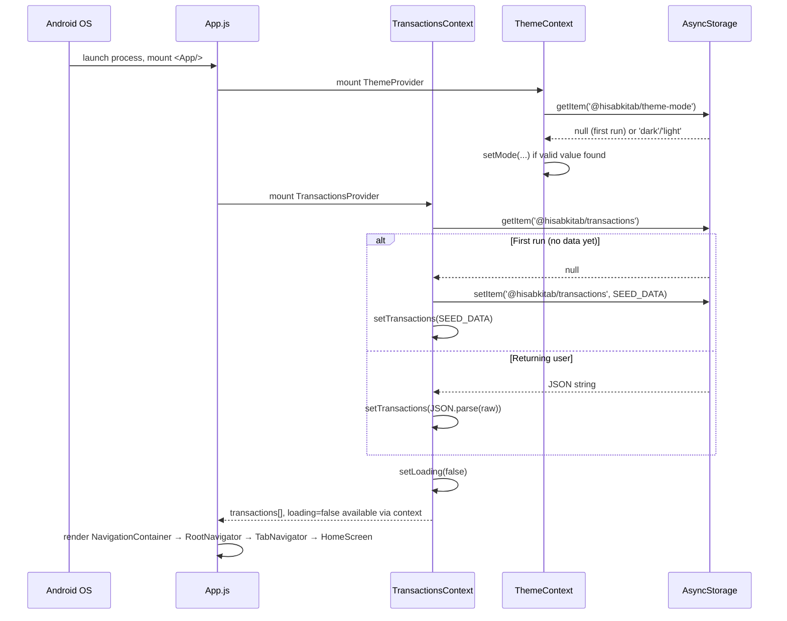
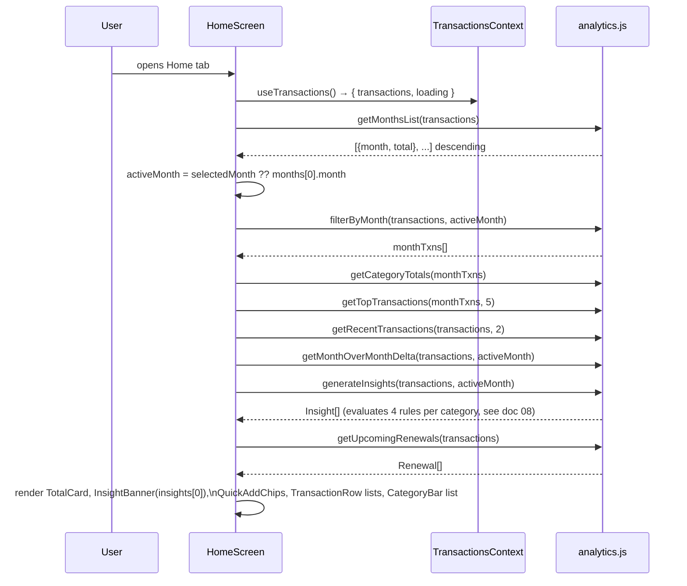
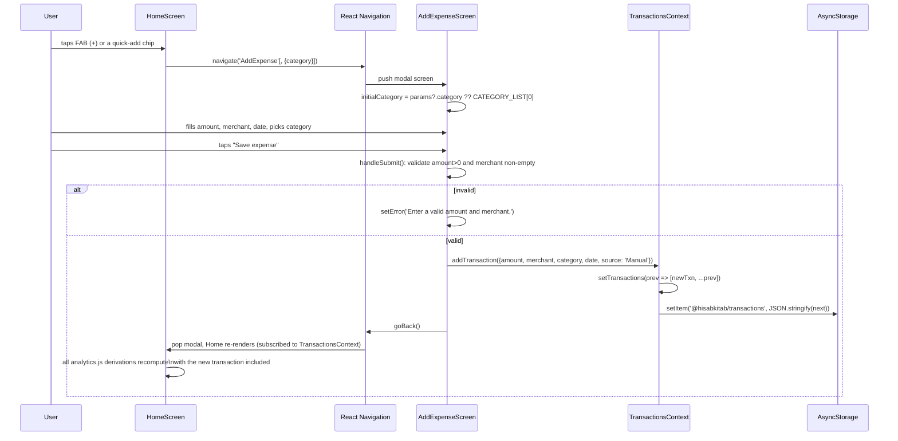
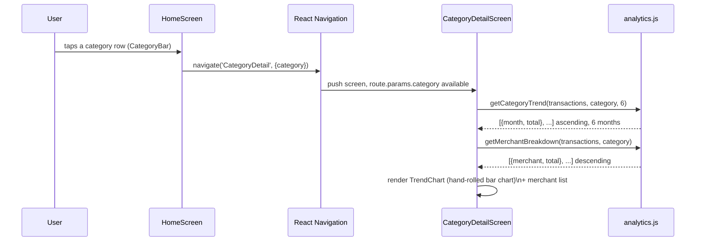
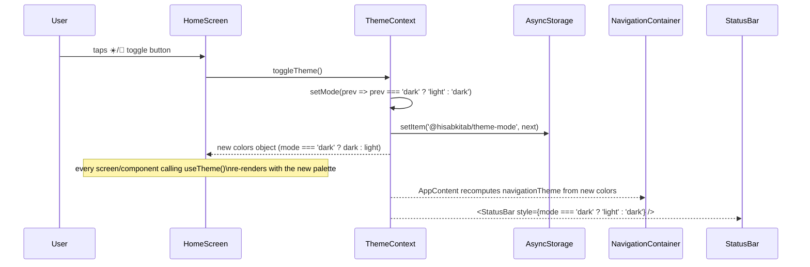
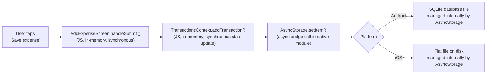

# 9. Data Flow & Diagrams

Sequence and flow diagrams for the major user journeys, tied to the exact functions/files involved.

## 9.1 App startup & first-run seeding

**Key detail:** `ThemeProvider` and `TransactionsProvider` load independently and in parallel (two separate `useEffect`s, two separate `AsyncStorage` keys) — neither blocks the other. `HomeScreen` alone waits on `TransactionsContext.loading` before rendering real content (`ThemeContext` has no loading gate — see [06-state-management-and-internal-api.md](06-state-management-and-internal-api.md#62-themecontext-srccontextthemecontextjs)).

## 9.2 Home screen load → insights computed

Every one of these `analytics.js` calls is wrapped in `useMemo` with `[transactions, activeMonth]` (or a subset) as dependencies — so switching the selected month recomputes everything, but a re-render caused by something unrelated (e.g. the theme toggling) does **not** recompute analytics, it only re-renders with the same memoized values.

## 9.3 Adding an expense

**Why the UI updates immediately without an explicit "refresh":** `HomeScreen` (and every other screen) reads `transactions` via `useTransactions()`. Calling `setTransactions` inside `addTransaction` triggers a React re-render of every component subscribed to that context — there's no manual cache invalidation or refetch step, because there's no cache separate from the live state.

## 9.4 Category drill-down

## 9.5 Theme toggle

This is a full-tree re-render (every mounted screen/component using `useTheme()` re-renders), which is fine here because it's a deliberate, infrequent, whole-app visual change — not something to optimize away. See [15-performance.md](15-performance.md).

## 9.6 End-to-end: from a tap to a persisted byte on disk

To make the "no backend" architecture completely concrete, here is literally everything that happens between the user tapping "Save expense" and the data being durable:

There is no network hop anywhere in this diagram — this is the entire persistence story for the app.

## 9.7 Where to go next

- The exact business rules driving §9.2 and §9.4's computations: [08-business-logic-and-analytics.md](08-business-logic-and-analytics.md)
- The full Context/function API referenced throughout these diagrams: [06-state-management-and-internal-api.md](06-state-management-and-internal-api.md)
- Why re-renders here are cheap enough not to worry about: [15-performance.md](15-performance.md)
